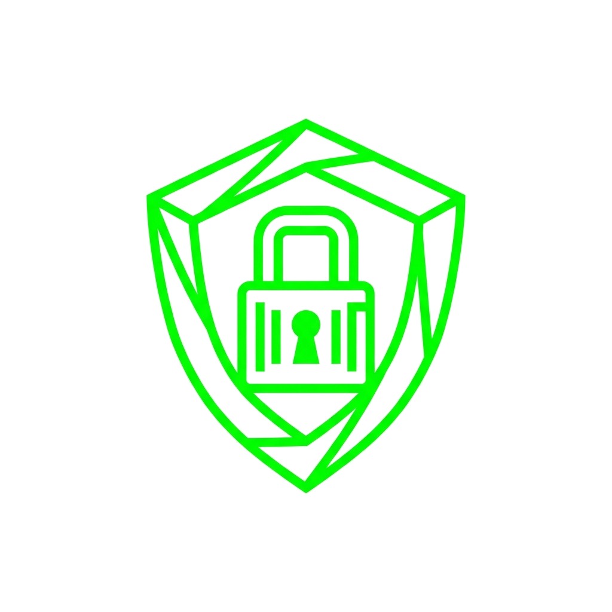

<div align="center">



# 🛡️ CyberGuardian

### *Your AI-Powered Mobile Cybersecurity Companion*

[](https://flutter.dev)
[](https://dart.dev)
[](https://firebase.google.com)
[](https://www.virustotal.com)
[](LICENSE)
[](https://flutter.dev)

<br/>

> **CyberGuardian** is a full-featured, production-grade mobile application built with Flutter that empowers everyday users to protect themselves in the digital world — through real-time threat scanning, cybersecurity education, scam reporting, and interactive learning modules.

<br/>

---

</div>

## 📋 Table of Contents

- [✨ Key Features](#-key-features)
- [🎯 App Overview](#-app-overview)
- [🏗️ Architecture](#️-architecture)
- [🧰 Tech Stack](#-tech-stack)
- [📦 Dependencies](#-dependencies)
- [🚀 Getting Started](#-getting-started)
- [🔧 Configuration](#-configuration)
- [📁 Project Structure](#-project-structure)
- [🔌 APIs & Integrations](#-apis--integrations)
- [🛡️ Admin Panel](#️-admin-panel-features)
- [👤 Author](#-author)

---

## ✨ Key Features

<table>
<tr>
<td width="50%">

### 🔍 Multi-Type Threat Scanner
- **URL Scanning** via VirusTotal API with 70+ antivirus engine analysis
- **SMS Phishing Detection** using heuristic text analysis
- **Email Threat Analysis** for malicious content detection
- **Password Strength Checker** with entropy scoring
- Full **scan history** with timestamps and results

</td>
<td width="50%">

### 📰 Live Cybersecurity News
- Real-time cybersecurity news feed
- Curated articles from trusted security sources
- Deep-link launch to full articles in browser
- Notification bell with live update indicator

</td>
</tr>
<tr>
<td width="50%">

### 🎓 Interactive Learning Hub
- Structured courses: **Beginner → Advanced**
- Lesson viewer with embedded **YouTube video** support
- **Quiz system** with score tracking & instant feedback
- **Completion certificates** generated as PDF
- Personal progress tracking per course

</td>
<td width="50%">

### 📊 Reports & Analytics
- Tabbed reports dashboard: Scans, Activity, Community
- Submit scam/phishing reports to shared community database
- Visual statistics with interactive charts (`fl_chart`)
- Export reports to **CSV / Excel**
- Full **Admin Panel** for platform oversight

</td>
</tr>
<tr>
<td width="50%">

### 🔐 Secure Authentication
- Firebase Email/Password authentication
- **Two-Factor Authentication (2FA)** screen
- Role-based access control (User vs. Admin)
- Persistent sessions with secure logout

</td>
<td width="50%">

### 👤 User Profile & Settings
- Avatar upload (camera/gallery) via Firebase Storage
- Edit profile, change password inline
- Light / Dark mode toggle (Material 3)
- Language settings & notification preferences
- Privacy Policy & Help Center screens

</td>
</tr>
</table>

---

## 🎯 App Overview

CyberGuardian addresses a real-world problem: **most users have no easy way to verify whether a link, message, or email is safe before they click.** This app bridges that gap by putting enterprise-grade security tools in the palm of every user's hand.

```
┌─────────────────────────────────────────────────────┐
│              CYBERGUARDIAN ECOSYSTEM                │
├──────────────┬──────────────┬───────────────────────┤
│  SCAN ENGINE │  EDUCATION   │  COMMUNITY & REPORTS  │
│              │              │                       │
│ • URL Scan   │ • Courses    │ • Scam Reporting      │
│ • SMS Scan   │ • Quizzes    │ • Community Feed      │
│ • Email Scan │ • Lessons    │ • Admin Analytics     │
│ • Pwd Check  │ • Cert PDFs  │ • Export CSV/Excel    │
└──────────────┴──────────────┴───────────────────────┘
```

### 🔒 Security Score System
Each user has a **dynamic Security Score (0–100)** that updates based on scan history, threats detected, and courses completed — giving a gamified incentive to stay cyber-aware.

---

## 🏗️ Architecture

CyberGuardian follows a **layered clean architecture** pattern, clearly separating concerns across data, business logic, and presentation layers.

```
lib/
├── main.dart              ← App entry point, routing, theming
├── firebase_options.dart  ← Firebase platform configs
│
├── models/                ← Data transfer objects
├── providers/             ← State management (Provider)
├── services/              ← Business logic & external API layer
├── screens/               ← 24 full UI screens
├── widgets/               ← Reusable & feature-specific widgets
├── data/                  ← Static content (learning curriculum)
└── utils/                 ← Constants, colors, helpers
```

**State Management:** Provider pattern  
**Backend:** Firebase (Auth + Firestore + Storage)  
**Threat Intelligence:** VirusTotal REST API  
**Data Flow:** Screens → Services → Firebase/APIs → Models → UI via `StreamBuilder` / `FutureBuilder`

---

## 🧰 Tech Stack

| Layer | Technology | Purpose |
|-------|-----------|---------|
| **Framework** | Flutter 3.x (Dart 3.x) | Cross-platform UI |
| **State Management** | Provider | Reactive state across widgets |
| **Authentication** | Firebase Auth | Secure user login/registration |
| **Database** | Cloud Firestore | Real-time NoSQL data storage |
| **File Storage** | Firebase Storage | Avatar and document uploads |
| **Threat Intelligence** | VirusTotal API v3 | 70+ AV engine URL scanning |
| **Charts** | fl_chart | Analytics visualizations |
| **PDF Generation** | pdf + printing | Completion certificates |
| **Video Player** | youtube_player_iframe | In-app lesson videos |
| **Data Export** | csv + excel | Report downloads |
| **Icons** | Phosphor Icons | Consistent icon system |
| **Image Handling** | image_picker | Camera/gallery photo selection |

---

## 📦 Dependencies

```yaml
dependencies:
  # Core Flutter
  cupertino_icons: ^1.0.8

  # State & Persistence
  provider: ^6.1.2
  shared_preferences: ^2.5.5

  # Firebase Suite
  firebase_core: ^3.6.0
  firebase_auth: ^5.3.1
  cloud_firestore: ^5.4.4
  firebase_storage: ^12.3.4

  # Networking & Launching
  http: ^1.2.2
  url_launcher: ^6.2.5

  # UI & Media
  phosphor_flutter: ^2.1.0
  image_picker: ^1.1.2
  youtube_player_iframe: ^6.0.2
  fl_chart: ^0.68.0

  # Document Generation & Export
  pdf: ^3.11.1
  printing: ^5.13.3
  csv: ^6.0.0
  excel: ^4.0.0
```

---

## 🚀 Getting Started

### Prerequisites

Ensure the following are installed on your machine:

- ✅ [Flutter SDK](https://docs.flutter.dev/get-started/install) — v3.x or later
- ✅ [Dart SDK](https://dart.dev/get-dart) — v3.x or later  
- ✅ [Android Studio](https://developer.android.com/studio) or [VS Code](https://code.visualstudio.com/) with Flutter extensions
- ✅ A Firebase project (see [Configuration](#-configuration) below)
- ✅ VirusTotal API key (free tier available)

### Installation

```bash
# 1. Clone the repository
git clone https://github.com/WaseefUllahh/CyberGuardian.git
cd CyberGuardian

# 2. Install all dependencies
flutter pub get

# 3. Run the app on a connected device/emulator
flutter run

# 4. Build a release APK for Android
flutter build apk --release

# 5. Build release IPA for iOS
flutter build ipa --release
```

---

## 🔧 Configuration

### Firebase Setup

1. Visit [Firebase Console](https://console.firebase.google.com/) and create a new project.
2. Enable the following services:
   - ✅ **Authentication** → Email/Password provider
   - ✅ **Cloud Firestore** → Start in test mode, then add rules
   - ✅ **Firebase Storage** → For avatar uploads
3. Register your Android app and download `google-services.json` → place in `android/app/`.
4. Register your iOS app and download `GoogleService-Info.plist` → place in `ios/Runner/`.
5. Run FlutterFire CLI to generate configuration:
   ```bash
   dart pub global activate flutterfire_cli
   flutterfire configure
   ```

### VirusTotal API

1. Create a free account at [virustotal.com](https://www.virustotal.com/).
2. Get your **API key** from your profile → API key section.
3. Add it to `lib/services/virus_total_service.dart` or via environment config.

> ⚠️ **Security Note:** Never commit API keys to version control. Use environment variables or a `.env` file (gitignored).

---

## 📁 Project Structure

```
flutter_application_1/
├── lib/
│   ├── main.dart                        # Bootstrap: routing (17 routes), theming
│   ├── firebase_options.dart            # Auto-generated Firebase platform configs
│   │
│   ├── models/                          # Data layer (DTOs)
│   │   ├── user_model.dart              # User entity with security score
│   │   ├── scan_model.dart              # Individual scan result
│   │   ├── report_model.dart            # Community scam report
│   │   ├── news_model.dart              # News article
│   │   ├── learning_models.dart         # Course, Lesson, Quiz models
│   │   └── learning_progress.dart       # Per-user progress tracker
│   │
│   ├── providers/
│   │   └── theme_provider.dart          # Light/Dark mode state
│   │
│   ├── services/                        # Business logic & API layer (14 services)
│   │   ├── auth_service.dart            # Firebase Auth CRUD
│   │   ├── virus_total_service.dart     # VirusTotal REST API integration
│   │   ├── url_scan_service.dart        # URL scanning + Firestore persistence
│   │   ├── message_scan_service.dart    # SMS/Email heuristic scanning
│   │   ├── text_analysis_service.dart   # NLP-style phishing detection
│   │   ├── password_service.dart        # Password entropy & strength scoring
│   │   ├── news_service.dart            # Cybersecurity news aggregation
│   │   ├── learning_service.dart        # Course progress & quiz management
│   │   ├── certificate_service.dart     # PDF certificate generation
│   │   ├── report_service.dart          # Community scam report CRUD
│   │   ├── profile_service.dart         # Avatar upload & profile updates
│   │   ├── admin_service.dart           # Admin-level data operations
│   │   ├── activity_service.dart        # User activity log
│   │   └── firestore_service.dart       # Low-level Firestore helpers
│   │
│   ├── screens/                         # Presentation layer (24 screens)
│   │   ├── splash_screen.dart           # Animated launch screen
│   │   ├── login_screen.dart            # Firebase login form
│   │   ├── signup_screen.dart           # Registration with validation
│   │   ├── main_navigation_screen.dart  # Bottom navigation host
│   │   ├── dashboard_screen.dart        # Security score + quick actions
│   │   ├── scanner_screen.dart          # URL/SMS/Email/Password scanner
│   │   ├── scan_history_screen.dart     # Paginated scan history log
│   │   ├── learning_screen.dart         # Course catalog with filters
│   │   ├── course_detail_screen.dart    # Lesson list + video + quiz
│   │   ├── lesson_screen.dart           # Individual lesson content
│   │   ├── quiz_screen.dart             # Interactive MCQ quiz
│   │   ├── news_screen.dart             # Live cybersecurity news feed
│   │   ├── reports_screen.dart          # Tabbed reports dashboard
│   │   ├── submit_report_screen.dart    # Community scam report form
│   │   ├── profile_screen.dart          # Full user profile
│   │   ├── edit_profile_screen.dart     # Profile editing
│   │   ├── change_password_screen.dart  # Password update flow
│   │   ├── two_factor_screen.dart       # 2FA configuration
│   │   ├── admin_panel_screen.dart      # Full admin control panel
│   │   ├── notification_settings_screen.dart
│   │   ├── language_settings_screen.dart
│   │   ├── help_center_screen.dart
│   │   ├── about_screen.dart
│   │   └── privacy_policy_screen.dart
│   │
│   ├── widgets/                         # Reusable UI components
│   │   ├── admin/                       # 15 dedicated admin panel views
│   │   ├── dashboard_widgets.dart       # Hero cards, stat boxes, action tiles
│   │   ├── scanner_widgets.dart         # Scan panels per type
│   │   ├── learning_ui_widgets.dart     # Course cards, progress rings
│   │   ├── report_widgets.dart          # Report cards and filters
│   │   ├── dashboard_drawer.dart        # Side navigation drawer
│   │   └── premium_icon.dart            # Custom icon with glow effect
│   │
│   ├── data/
│   │   └── learning_content.dart        # Static cybersecurity curriculum
│   │
│   └── utils/
│       └── app_colors.dart              # Brand colors & global palette
│
├── assets/
│   └── images/                          # App logos & UI assets
│       ├── cyberguardian_logo.png
│       ├── protected_shield_bg.png
│       ├── icon_url.png
│       ├── icon_sms.png
│       ├── icon_email.png
│       └── icon_password.png
│
├── android/                             # Android Gradle configs
├── ios/                                 # iOS Xcode configs
├── firebase.json                        # Firebase project definition
└── pubspec.yaml                         # Project metadata & dependencies
```

---

## 🔌 APIs & Integrations

| Integration | Purpose | Details |
|------------|---------|---------|
| **VirusTotal API v3** | URL threat scanning | 70+ AV engines, community votes, threat categories |
| **Firebase Auth** | User authentication | Email/Password, session persistence |
| **Cloud Firestore** | Real-time database | Users, scans, reports, learning progress |
| **Firebase Storage** | File hosting | Avatar images and documents |
| **Cybersecurity NewsAPI** | Live threat news | Curated security headlines |
| **YouTube iFrame API** | In-app video lessons | Embedded player with full controls |

---

## 🛡️ Admin Panel Features

The app includes a **comprehensive Admin Dashboard** with 15 dedicated management views:

| # | View | Capability |
|---|------|-----------|
| 1 | **Dashboard** | Platform-wide KPIs, user counts, scan volume |
| 2 | **Users** | View, search, manage all user accounts |
| 3 | **Scan History** | Monitor and audit all scan activity |
| 4 | **Scam Reports** | Review and moderate community submissions |
| 5 | **Learning Manager** | Add, edit, and publish courses & lessons |
| 6 | **Quiz Manager** | Create and update quiz questions |
| 7 | **Notifications** | Compose and send push notifications |
| 8 | **Analytics** | Charts, trends, and usage graphs |
| 9 | **API Monitor** | VirusTotal API quota & usage tracking |
| 10 | **System Health** | App performance and uptime metrics |
| 11 | **Report Export** | Download all data to CSV/Excel |
| 12 | **Settings** | Global app configuration |
| 13 | **Admin Profile** | Admin account management |
| 14 | **Activity Log** | Full audit trail of admin actions |
| 15 | **Global Search** | Search across all platform entities |

---

## 🤝 Contributing

Contributions are welcome! Please follow these steps:

1. **Fork** the repository
2. **Create** a feature branch: `git checkout -b feature/AmazingFeature`
3. **Commit** changes: `git commit -m 'feat: Add AmazingFeature'`
4. **Push** to the branch: `git push origin feature/AmazingFeature`
5. **Open** a Pull Request with a clear description

Please follow [Conventional Commits](https://www.conventionalcommits.org/) for commit messages.

---

## 📄 License

This project is licensed under the MIT License — see the [LICENSE](LICENSE) file for details.

---

## 👤 Author

<div align="center">

**Waseef Ullah**  
*Mobile Application Developer | Flutter & Firebase Specialist*

[](https://github.com/WaseefUllahh)
[](https://www.linkedin.com/in/waseef-ullah-680377254/)

*Built with ❤️, Flutter, and a passion for digital security*

</div>

---

<div align="center">

### ⭐ If you found this project helpful or impressive, give it a star!

```
"Security is not a product, but a process." — Bruce Schneier
```

**© 2024 CyberGuardian. All rights reserved.**

</div>
